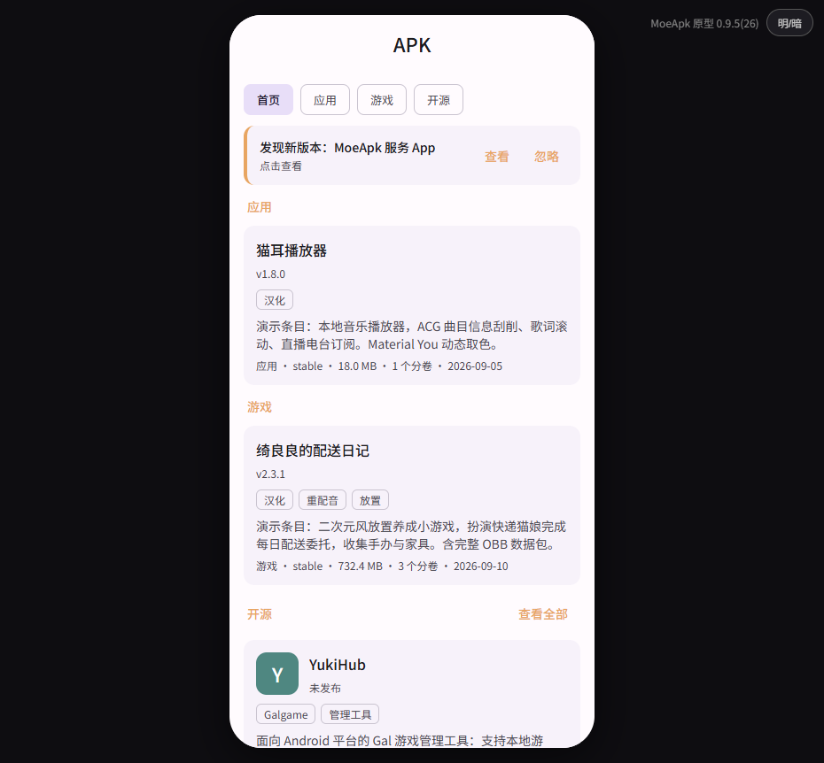
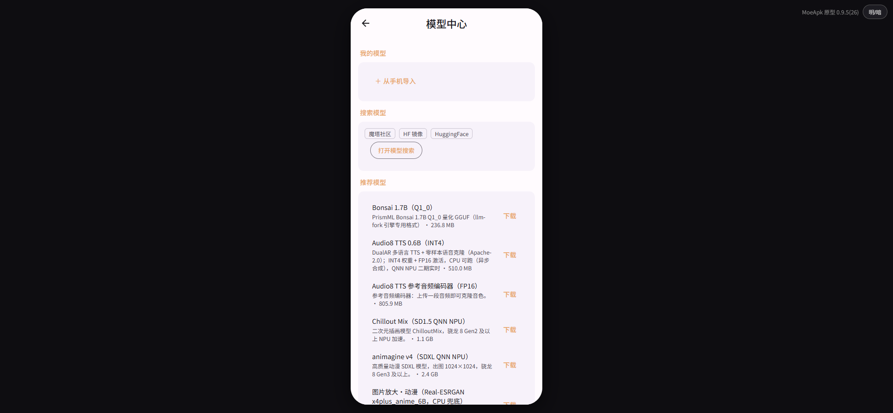
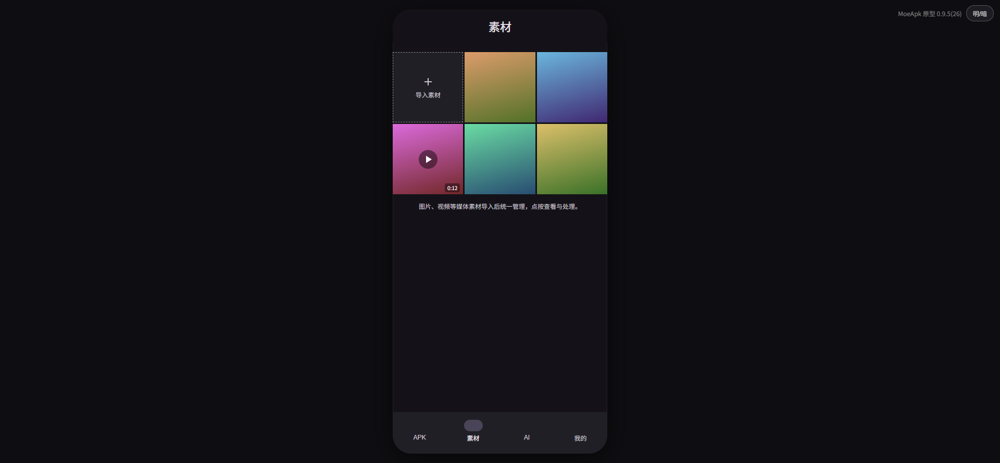
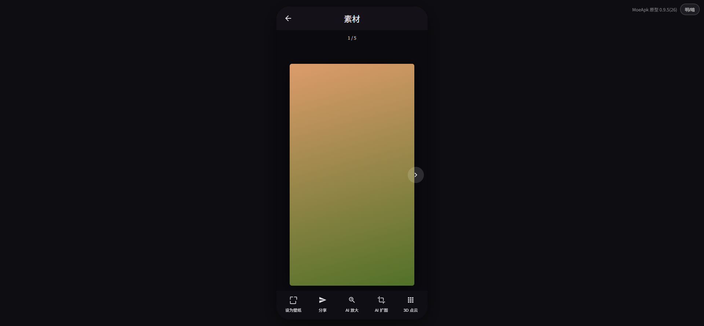
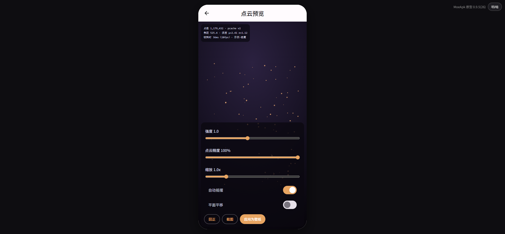
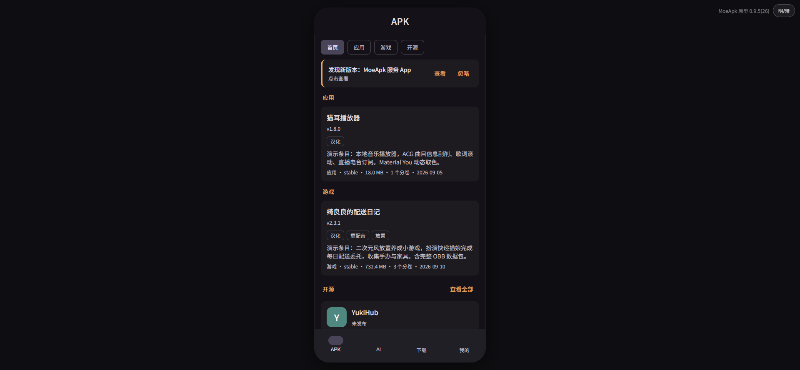

# MoeApk App UX（开源原型）

[MoeApk](https://moeapk.com) App 的界面设计原型：用**纯静态网页**（HTML/CSS/JS，零依赖零构建）对 App 的界面与交互做 1:1 还原，双击 `index.html` 就能在浏览器里"用上"这个 App。

这个项目的工作方式是：**所有界面调整先在原型里改、预览验证，满意后才会落到正式 App**。本仓库独立开源，任何人都可以 fork 后提出自己的改进点或全新设计——被采纳的方案会同步进正式 App。

> 本仓库只包含界面原型与设计文档，**不含 App 本体源码**（App 是独立的私有项目，本仓库的改动不影响它）。

## 在线预览

**<https://attect.github.io/moeapk-app-ux/>**

桌面浏览器打开后是手机框预览；用开发者工具切到移动视图（或把窗口收窄）即为全屏效果。右上角可切换 **明/暗主题** 与 **横屏**。

## 界面预览

| APK 首页 | 模型中心 | 素材网格 |
|---|---|---|
|  |  |  |

| 素材查看器 | 点云预览 | 暗色主题 |
|---|---|---|
|  |  |  |

## 用 AI Agent 修改原型（推荐方式）

原型是纯静态网页、没有任何构建步骤，非常适合交给 AI 编码工具（DeepSeek Harness、KimiCode、OpenCode、MimoCode、WorkBuddy、Qoder 各类 Agent 等）直接修改：

1. **Fork 本仓库**，并 clone 到本地；
2. 仓库根目录有一份 **[AGENTS.md](AGENTS.md)**——这是写给 AI 的项目说明书（架构地图、技术约定、禁区清单）。主流 AI 编码工具会**自动读取**它；如果你的工具不自动读，手动把它贴给 AI 或配置为项目上下文；
3. 用自然语言向 AI 描述你的想法，例如：
   - 「把模型中心的分类 Tab 改成侧边栏布局」
   - 「给下载任务页加一个批量暂停/继续」
   - 「设计一个全新的『我的』页面」
4. AI 改完后**双击 `index.html` 走查**：点亮/暗主题、竖/横屏都看一遍，确认效果符合预期；
5. 提交到你的 fork，向本仓库发 **Pull Request**。

## 贡献流程规范

- **小改进**（修 bug、调细节、优化交互）：直接提 PR 即可；
- **新设计**（新页面、新流程、大改版）：建议先开 [Issue](../../issues) 或在 [Discussions](../../discussions) 发帖说明思路，讨论通过后再动手，避免白忙；
- **PR 基本要求**：
  - 说明你改了什么、为什么这么改（用了 AI 也请注明，并确保自己理解改动内容）；
  - 附改动前后的截图（明/暗主题至少各一张）；
  - 一个 PR 只做一件事，便于评审；
- 更多细节见 [CONTRIBUTING.md](CONTRIBUTING.md)。

## 仓库里有什么

| 路径 | 说明 |
|---|---|
| `index.html` | 入口页面（含手机预览框与调试条） |
| `css/` `js/` | 原型的全部样式与逻辑（各页面在 `js/screens/`） |
| `js/data/` | 演示数据（应用目录、开源收录、AI 模型等） |
| `shots/` | 历次走查截图（设计沿革留档） |
| `docs/design-notes.md` | 完整设计文档：设计沿革、页面结构说明、与真机的差异 |
| `AGENTS.md` | 给 AI 编码工具的项目说明书（也是贡献者的技术约定） |
| `CONTRIBUTING.md` | 贡献指南 |

## 许可证

- **代码**（HTML/CSS/JS）：[MIT](LICENSE)，可自由使用修改；
- **`assets/` 内的品牌素材**（logo、图标、MoeApk 字体）：**不适用 MIT，保留所有权利**——仅允许在为向本仓库贡献而 fork/修改的范围内使用，不得二次分发或用于其他产品。
